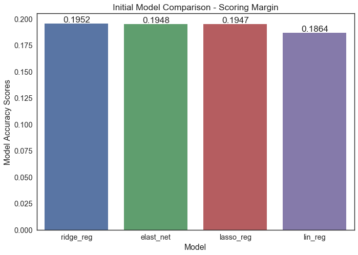
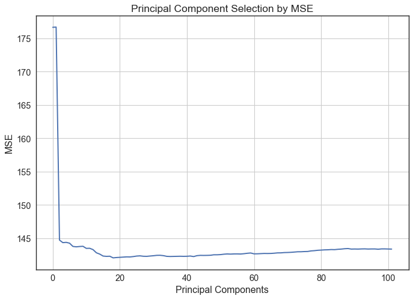
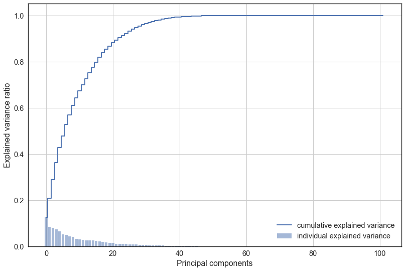
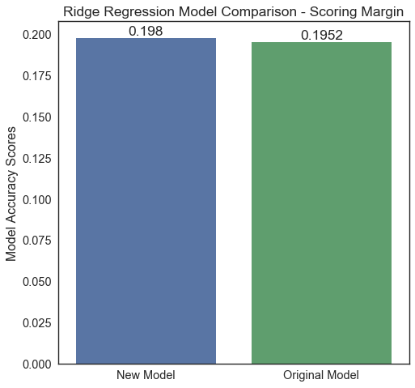
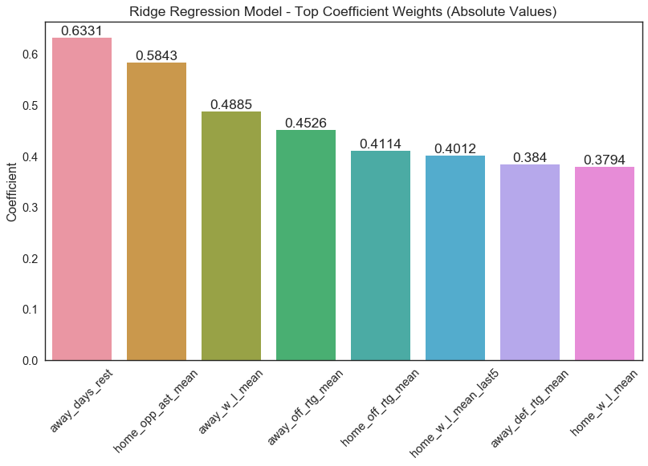
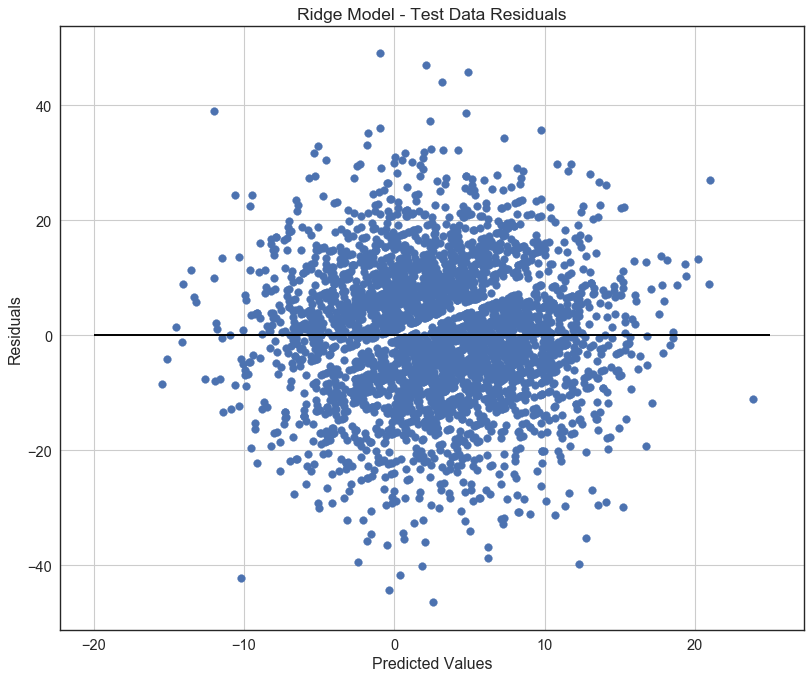

# A Supervised Learning Approach to NBA Scoring Predictions

### Introduction
This is an open-ended regression project for the Data Science program at [K2 Data Science](http://k2datascience.com).

### Goals
Scrape game-by-game NBA statistical data from the web and create a model to predict game scoring margins based on in-season statistics.

### Approach
This exercise was completed with the goal of scraping simple and readily available offensive and defensive statistics for each NBA game played over the course of 10 years.  Both conventional (e.g. field goals, rebounds, etc.) and advanced (e.g. effective field goal percentage, defensive rating, etc.) statistics were collected for each team in each game.

Statistical data was scraped from the  [basketball-reference](https://www.basketball-reference.com/) website.  The BeautifulSoup Python library was utilized to develop the scraping tools.

Once obtained and cleaned the data was to be utilized for training a regression model to predict scoring margins of future games.

### Organizing the Data
The data was scraped on a team by team basis.  To create a dataset that could be used for modeling purposes it was necessary to re-organize to a league-wide schedule including relevant statistics for both the home and away teams.

Game level statistics were used to create progressive expanding mean features for each team in each season.  For example, the features for a game where the home team is playing in their 15th game of the season and the away team is playing in their 13th game of the season, each feature represents the average statistic over the first 14 games of that season for the home team and the first 12 games of that season for the away team.

Features accounted for both the average performance of a team and the average performance of their opponents.  In total, 102 features were included with each record.

The scoring margin target feature for the model was created by taking the difference between the home team's points and away team's points for each game of each season.

Since we are only exploring linear models, all of the data was scaled using the StandardScaler class from the scikit-learn library.

### Data Exploration
A correlation heat map was created for home team statistics.  For simplicity the away team statistics were omitted, though the correlations can be assumed to be similar.

It is clear that many statistics have moderate to strong correlation with one another.  This is a result of many derivative statistics being included in the feature space.  For instance, we have included field goals, field goal attempts, and field goal percentage as well as many advanced statistics such as effective field goal percentage which all essentially account for field goals attempted and made.

### Linear Model Evaluation
The following 4 linear models were created to get an estimate of baseline performance: Linear Regression, Lasso Regression, Ridge Regression and Elastic-net.

The models were evaluated using all available predictor variables.  For the ridge and lasso models, cross validation was utilized to select the regularization parameters.  The scikit-learn library was utilized for each model.  For simplicity and consistency all models were compared using the R^2 value.

It was noted that the ridge, elastic-net and lasso models outperformed the traditional ordinary least squares (OLS) model.  This is likely due to the extreme multicollinearity that was observed in the feature space.

### Multicollinearity
There are many approaches to dealing with the multicollinearity issues present in our data set.  Ideally, going through a process of feature selection where we systematically eliminate features that have collinear relationships until we are left with a smaller, more diverse data set would be the preferred approach.  While this may still be an option in our case, our data points are so highly correlated that such an exercise may prove tedious and remove too much relevant information from our model.

Ridge, lasso, and elastic-net tend to limit the deleterious effects of multicollinearity by imposing regularization on the model.  Lasso implements L1 regularization which tends to impose sparsity among the model coefficients, while ridge implements L2 regularization which limits the overall size of the coefficient vector.  regularization in the elastic-net model is a mix of L1 and L2.

### Principal Component Regression
Principal component regression (PCR) can also assist in alleviating effects of multicollinearity by transforming the feature space to a condensed number of orthogonal principal components prior to forming the regression model.  

To evaluate if this model is appropriate for our application we first transform our features using the PCA class from scikit-learn.  We then checked the mean squared error (MSE) of a cross-validated OLS model using a successive number of principal components.  The results are shown below.

The above graph shows that the minimum MSE value approximately corresponds to 18 principal components.  Checking this model we find that the R^2 value is approximately 0.194.  This performance still lags somewhat behind our top performing models from above.

Looking at the graph below we can also see that using the first 18 principal components we are including less than 90% of explained variance of our features.  

For both of these reasons we will choose not to pursue PCR further.

### Feature Engineering
With the intent of improving our model we attempted to create new features which may provide additional insights.  

#### Recent Team Performance
First, we thought it may be worth exploring if recent team performance affects game outcome.  Currently we are only inputting season averages for each statistic.  However, this doesn't account for hot or cold streaks that may be the result of team cohesion, injuries or countless other factors.

To account for recent performance we selected features that had the highest correlation with scoring margin.  The correlation threshold for feature selection was, somewhat arbitrarily, set at a correlation coefficient value of 0.25.  The features that met this criteria were home team offensive rating and home team winning percentage.  Two new features were created to represent the average of these statistics of just the previous 5 games.

#### Team Rest Prior to game
The next feature we created was days of rest prior to the game.  This was simply a numerical representation of team rest coming into the game in days time.  This feature attempts to account for fatigue resulting from closely spaced games.

#### Distance Traveled
The final feature we created was distance traveled by the away team for each game.  The GeoPy library was used to determine miles between each team's home city.  It is noted that this feature does not account for road trips (consecutive road games by visiting team) in which the team may not have traveled the entire distance prior to the game.

#### Model improvement
The previously top performing model (ridge) was reconstructed to include the new features and compared with the previous model to determine feature impact.

It appears that the new features had a slight positive improvement on the R^2 value of our cross validated models.

### Final Model
Based on the results above the Ridge model was selected for further testing.  The model was trained using cross validation to determine the regularization parameter.  The model produced approximate R^2 and MSE values of 0.177 and 148.5, respectively.  The regularization parameter selected during cross validation was 1,842.  This is an extremely high value which severely restricts the individual coefficient weights.

We next examined the coefficient weights to examine which features have the highest impact on the model.

As noted above, the coefficient weights have been suppressed by the model regularization process.  It is noted that 2 of our engineered features are ranked in the top 8 most influential coefficients, with away team days rest having the greatest influence.

A residuals plot is included below.

The plot is observed to be evenly distributed in both dimensions with a cluster around the center indicating a well fit model.  The clear space that cuts diagonally through the origin is created because no NBA games end in a tie, making a score margin of 0 impossible.

### Further Analysis
Below are items we would have explored if we had more time:

1. As noted earlier, many of our features were highly correlated with each other.  Some brief explorations were made with feature selection but ultimately abandoned due to lack of model improvement.

2. Variance inflation factor (VIF) was also briefly explored for evaluation of multicollinearity.  However, VIF values were quite large for virtually all features making evaluation difficult.

3. Explore and correct skewed features.  Linear regression assumes normally distributed features.  Exploration and correction may improve model results.

4. Engineer additional features.  We saw positive results from this exercise and there are countless additional approaches that could be made.
